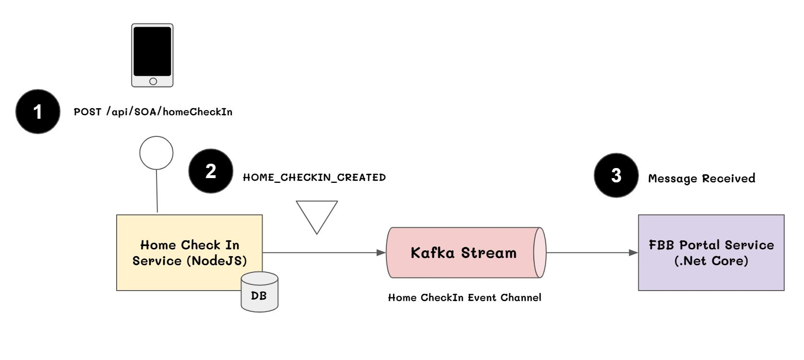

# Microservices, Event-Driven Architecture and Kafka

## Architecture




## Event Driven Patterns
Event Driven architecture comes in different flavours. Let’s have a look on the most common patterns.

**Event Notification**
In this design pattern the events are meant to just notify a state change. They don’t carry any state, they are just telling that something has happened. Usually, the sender doesn’t expect any response. It is not meant for a back and forth communication. An event notification implies a clear separation between the sender and the eventual receivers. As such, there is low coupling between them. Anyone can receive the notification, the sender just doesn’t care.

**Event-Carried State Transfer**
As the name suggests, in this pattern the event will contain an entire state not just a notification. All the information that a client needs are contained in that event. The client doesn’t need to call the sender for extra information. 

**Event Sourcing**
Another event driven pattern is the event-sourcing. Here, all the events are recorded and the system’s state could be recreated by replying all the events. The entire record base becomes the single source of truth.

**CQRS**
Command Query Responsibility Segregation (CQRS) is the notion of having separate data structures for reading and writing information. Strictly CQRS isn't really about events, since you can use CQRS without any events present in your design. But commonly people do combine CQRS with the earlier patterns here, hence their presence at the summit.

## Kafka and Event-Driven Architecture

There are many technologies these days which you can use to stream events from a component to another, like Aws Kinesis, Apache Flink, Rabbit Mq and many others.

Apache Kafka, which is maybe the most popular streaming service out there, and why it’s a good fit for Event-driven architecture.


Apache Kafka is a distributed streaming platform capable of handling trillions of events per day. Considering it's design, it gives you both the advantages of a queue message and a publish-subscriber service.

**How it Works**

Kafka stores the events in topics. A topic is a logical split among the data, like a category. 

https://github.com/tarathep/fundamental-kafka


## Initialze Stack
- Apache Kafka : https://kafka.apache.org/
- Mongodb : https://www.mongodb.com/
- NodeJS : https://nodejs.org/
- .Net Core : https://dotnet.microsoft.com/

## Data for Demo
SOA-Portal-Service
```sh
curl --location --request POST 'http://localhost:3000/api/SOA/home/checkin' \
--header 'Content-Type: application/json' \
--data-raw '{
    "internetNo": "8850049302",
    "orderNo": "5960915_106347524.2",
    "staffCode": "cs_eng_ftth",
    "jobStatus": "homecheckedin",
    "checkinLatitude": 13.7827811,
    "checkinLongitude": 100.5465937,
    "checkinDate": "2021-03-18 10:13:43"
}'
```


## More Details
**NodeJS Choreography-based saga pettern**
https://github.com/tarathep/nodejs-microservice-saga-pettern 

**Kafka ASP .Net Core Event Driven Microservices**
https://github.com/tarathep/kafka-asp-net-core-event-driven-microservices
